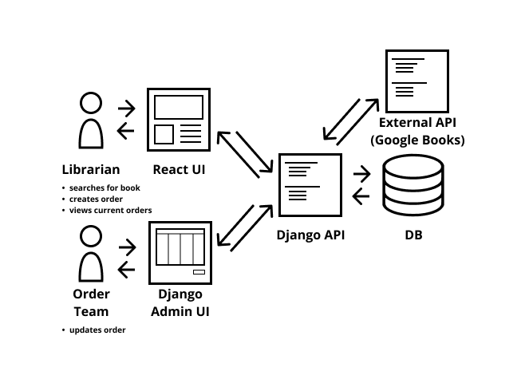
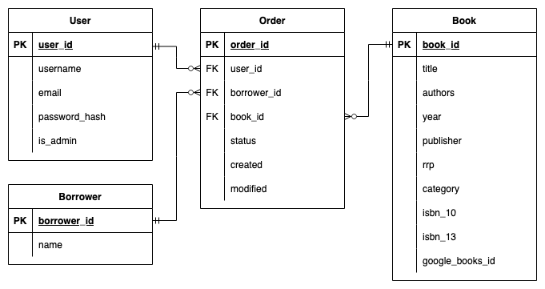

# Group 1: Specialisation Homework Week 1
**Group members: Eleanor Crossey Malone, Mariam Hussein, Anna Sapsford-Francis, Margalida Bover**

## What we’re building
An application for quickly finding bibliographic information and submitting purchase requests to a library’s purchasers. This will streamline the current search and ordering process used by many libraries, which is typically done manually. 

## What problem does our project solve?
When a library does not have a copy of a particular book in its catalogue, library users can be offered the option of submitting a “Request To Purchase” (RTP). This means that a request is sent to the persons responsible for buying library stock, such as a stock team or subject librarian. This request must contain information on the title of the book, the author, ISBNs, as well as publishing and other information.

The Library Management System used on staff computers frequently does not include this facility. The process of submitting a request is often done in an outdated way, with staff having to manually find the bibliographic information, add this to a physical form or word document, and send it as an email attachment. Purchasers then need to add this manually to a spreadsheet so that the status of the request can be monitored and updated.

This process could be simplified and modernised by connecting a user interface to an external API (such as Google Books API) to find the title’s bibliographic information, and then store it in a database where it can be easily accessed by library purchasers.

## Key features
As part of the planning and preparation for this project, the team has proposed a Minimum Viable Product (MVP) to work towards to ensure the project expectations are realistic and doable. As part of the MVP, the team will be working on the following key features to fulfil the function of storing and searching for bibliographic information for a library:

### Automatic Search Function
The main feature of this project is to allow users to search for a book based on 3-4 key pieces of information (Book Title, Author(s), Published Year, and the ISBN Code). Based on this, the aim is to have a results page of the books that fall within the relevant critieria. The user can then select their book of interest and pull up a page to see all the relevant information, including editions, retail price, and the category. If it is the book they intend to order to use at the library, they can then select the book to be ordered. 

The automatic search function depends on the GoogleBooks API as it has the largest collection of physical and electronic books online. The API has comprehensive information for books, which include thumbnail pictures, book previews, and retail information. Based on the GoogleBooks API, we hope to create a form that can either automatically pull up the data (like a postcode lookup) or just act as a search engine to confirm the books a user wants to order. 

### Manual Input Form
If a user’s book is not found by GoogleBooks API, they have the option to manually fill in a comprehensive form to manually order their book. The aim is to have the same form for both options (automatic and manual) and to then order the requested book using information pulled from the API or the manual form. 

### Working front-end 
The final aim is to have a fully functioning React-based front-end that has all the basic pages required from an organisation, such as a Homepage, Contact Us, About Us, and the Book Ordering webpages. The minimal amount of pages will help us focus on pulling together a consistent front-end and strong back-end system to support the book ordering mechanics. 

Beyond the MVP, we have aimed to have two stretch goals to aim for if we finalise and complete our MVP before then. The aim behind this is to challenge all members of the team whilst maintaining realistic goals for this project. 

### Stretch Goal 1: Log-on Functionality
Using Django as the supporting framework for this, we aim to utilise Django’s support for SQL Databases, testing system, authentication, and other third-party support packages to create a log-on feature for this project. Django provides a secure and easy way to access data from an SQL Database to then display on a React Front-end due to its built-in features.

If done successfully, we aim to have a log-on function for Librarians and Users to look at the list of books they have searched and ordered for. This provides a layer of security for Librarians to check for all the books ordered and allows users to check for their own ordered books. 

### Stretch Goal 2: Order Progress Tracker
As part of the tracking of orders, the log-on functionality will provide an option to check the status of a book’s order (Submitted, Accepted, Rejected, In Transit, Delivered). A second issue faced by the Library in this example is that the user has to call or keep constant track of their book orders by coming in-person. By having the log-on functionality, it provides a method for the user to check without having to enquire at the library. 

## Architecture diagram

Librarians will access the application through a React frontend hosted within a Django template.

The librarian will be able to log in via a static Django page that will redirect them to the React frontend once they are authenticated.

When they search for a book the React UI will make a request to the backend Django API, which will send a request to Google Books API to get book search results. The Django API will filter out unnecessary fields, flatten the JSON results and return them to the React frontend. 

When the librarian selects a specific book, React will again send a request to the Django API, which will request book details from Google Books. Then the Django API will process the JSON data and return it to the React frontend.

When the librarian creates an order, a post request containing the book and order details will be sent to the Django API. The API will then validate the data and, if valid, save the data to the relevant tables of a SQLite database. This endpoint will only be accessible if the user is authenticated.

The order team will have access to the application through the Django admin view, which is a configurable admin system that Django provides. The team will be able to log in, view the current orders within the database and then update them.

The librarian will be able to view the orders they have created and see their current status. When they view this part of the React frontend, React will send a get request to the Django API. Then, if the user is authenticated, the API will return the details of the user's current orders.

### Database Structure

There will be four tables: User, Borrower, Book and Order.

The User table is automatically generated by Django and will contain fields relating to the library staff member. The order team will have is_admin set to true and the librarians will have it set to false. This will determine whether they can access the Django admin view. 

The Borrower table will contain fields related to the member of the public who has made the initial request to the librarian. In a full implementation of this application this data would already exist in the Library Management System.

The Book table will contain fields related to the book being ordered. We will be using an auto-incrementing book id, because some books do not have an ISBN.

The Order table will function as a junction table with foreign keys to the user who created the order, the borrower who requested the order and the book that was requested. In addition, there will be a status field and two timestamp fields: one for when the order was created and one for when it was last modified. This will help staff members to track changes to orders.

An order can have only one and only one:
- user
- borrower
- book

Whereas users, borrowers and books can have zero or many orders.

## Our approach
The collective approach to this project has been on strength-based skills and the incorporation of Agile workflow structures to help realise this project.

As mentioned above, the team has agreed upon an MVP to work towards as the bare minimum. This is so the entire team is aware of the project expectations and features to work towards in a 4-week period. This has been outlined in the Key Features section.

To keep up with the project tasks, next steps, and expectations, the team uses a Trello board to practice Agile work practices at a beginner level. We deviated from Jira as this is only a 4-week long project. Jira’s usage is perfect for long-term projects with multiple tickets and requirements. If the project becomes overly complex, the team may switch to Jira. However, Trello has been able to provide an efficient co-working and task-management platform to track the development of this project.

In terms of task assignment, this has been based on the current technical and non-technical skill set and experience of each team member. An example is that Eleanor has graphic design experience and has mocked up templates of the logo and colour scheme. Other skill sets include strengths in back-end development, front-end development, project management, and so on. However, there is an expectation to help each other with tasks and to understand what has been made by each member. There has also been a Project Manager (Mariam) and Product Owner (Eleanor) assigned to ensure tasks stay relevant and the development of the project stays consistent with the problem being solved. Alongside this, the team has agreed to attend regularly (sometimes daily) stand-up meetings to discuss current issues, deliverables and the next steps to our projects. These meetings vary from 15 to 30 minutes each day but has become a way for the team to practise Agile methods. 

The actual workload itself has been assigned to be shared, so that there are 2 experts on the front-end and 2 experts on the back-end. This ensures that pair-coding can be achieved and allows for any necessary support to be brought in. The stand-up is also an opportunity to provide feedback on workload, expectations and any issues they may face. This is also communicated in the Trello board to provide an opportunity to bring up when a team member is facing extra workload or needs assistance. 

The project’s code is managed and compiled through a GitHub Organisation, which has its own repository to store all assets, code, and other relevant files. This allows the team to also create new branches to experiment with features or additions they feel will enhance the project beyond its MVP. As part of this, we’re also looking to test our code through the following methods.

### Testing Django and Python Backend
Based on the Django Documentation tools, we will be using the unittest module part of the Python library. Django also has options to use other testing frameworks as it has an API and integrations for other testing methods. However, for now we will be focusing on using unit tests as explored in the CFG Course. To further assist with writing our unit tests, we will be referring to Django’s documentation on [unit testing](https://docs.djangoproject.com/en/4.0/topics/testing/overview/) and Python’s documentation for the unittest [library](https://docs.python.org/3/library/unittest.html#module-unittest). In addition, Django allows us to test our database by creating a mock blank database for the testing portion of our back-end. 

### Testing React
By using Jest, the team aims to use this JavaScript testing framework to automatically allow for unit testing of our code at a basic level. As an example, we will be using Jest to test basic functions such as a function to retrieve relevant links for the next page of our site. Because Jest is a Visual Studio Code Extension, we aim to use this as it’ll automatically test any functions once we’ve saved the files in the relevant testing folders. This will help with our workflow as we can debug and address the issues early in our coding. As another benefit, the Jest Extension also allows us to understand the testing coverage and help us aim for a realistic amount of coverage for this app from the front-end perspective. 

Aside from unit testing to check whether specific functions are working or not. We will aim to explore Integration and Functional Tests to check whether the front-end of this React App can communicate with our database, system files, and our third party apps (such as GoogleBooks API). It will also provide an opportunity for us to confirm that our app is fully functional from the user point of view and that the current system works as intended. 

As a visual test we’ll be using responsive layout testing to see whether the React fits appropriately on a web page. For this specific project, we’ll be testing it by visiting our project on a phone and to change the width of our webpage to check the website behaviour and response. Although there are apps such as Cross Browser that we can use to test our code and visuals across a range of browser types and mobile devices, for this particular project, we will be using our own Browsers for this. 
If we’re unable to properly test with this, there is an online tool called JSFiddle that will allow us to instantly test our HTML, CSS and JavaScript in a browser and ensure it appears and responds the way it should be. 

### Self-teaching and skills development
As a vital note, the team will be continually researching methods to test the Library Ordering App at all levels of the stack. To ensure we thoroughly understand how to test for our app, we will be referring to YouTube videos, the various documentation available, and the usage of coding resources such as Codeacademy, FreeCodeCamp, and StackOverflow. The methods we use for testing may change over the duration of the project, but the above methods is what this project will start with.
