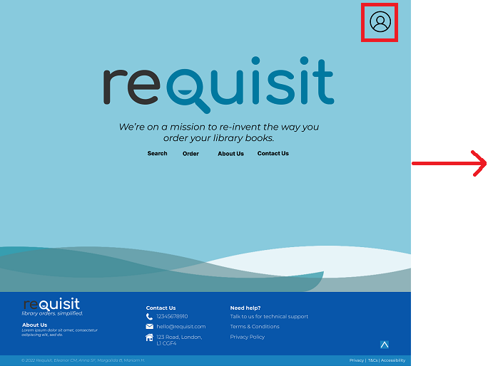
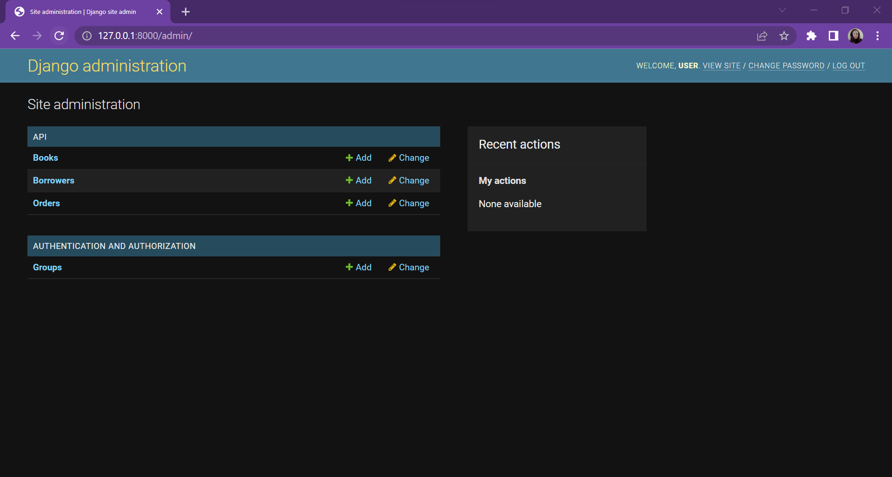
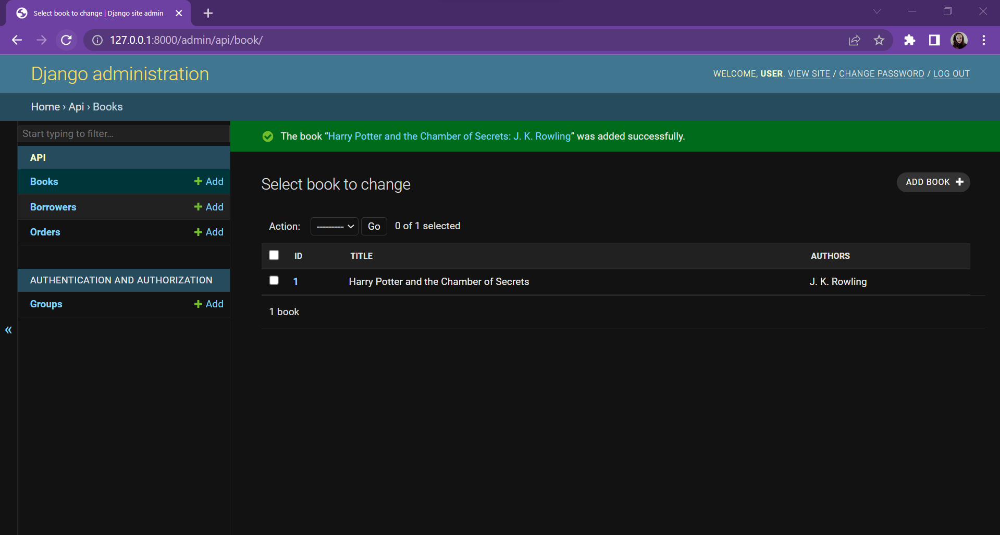
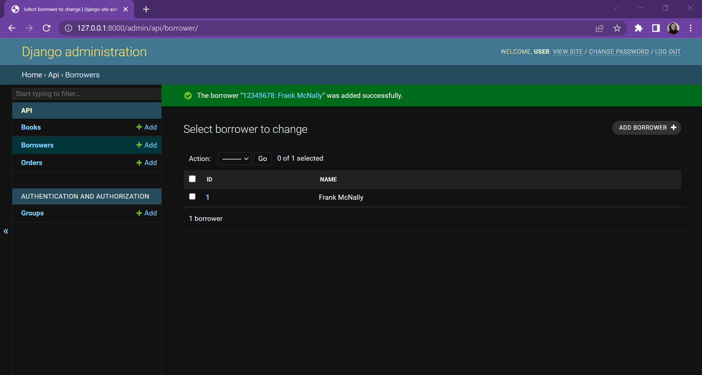
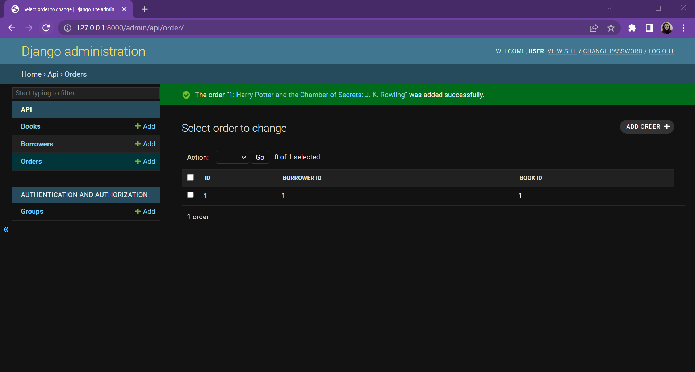
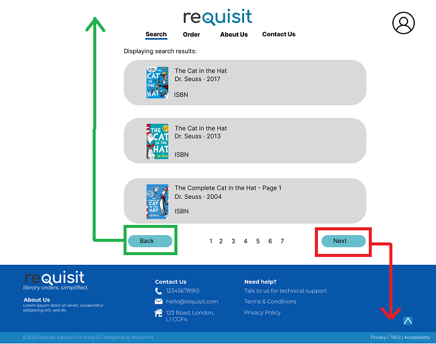
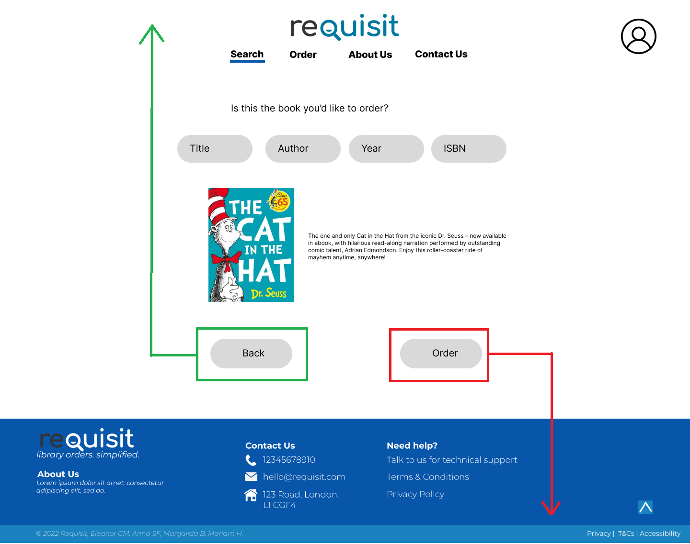

# Group 1: Specialisation Homework Week 2

**Group members: Eleanor Crossey Malone, Mariam Hussein, Anna Sapsford-Francis, Margalida Bover**

# Wireframe

### Figma wireframe of our project including all screens with an explanation of how each one leads to the other (e.g. an arrow going from one to the other).

To access the original Figma wireframe for accessibility, please [click here](https://www.figma.com/file/AOsm8bvRyUmlJ8lafFcgqX/Library-Book-Ordering-System?node-id=236%3A189). You can also access a basic walkthrough by [clicking here](https://www.figma.com/proto/AOsm8bvRyUmlJ8lafFcgqX/Library-Book-Ordering-System?node-id=236%3A190&scaling=contain&page-id=236%3A189&starting-point-node-id=236%3A190).

The full wireframe flowchart is available above. However, there is a breakdown below.

## Users

We have considered two types of users for this product, based on the information provided in the [project outline](https://github.com/CFG-Fullstack-1-Group-1/Library-Book-Ordering/blob/main/homework/week_1/homework_week_1.md):
- Librarians: These individuals will be able to search and place orders for books. They can also manually fill out a form for self-published or unavailable books.
- Stock Team: These individuals will be able to view the current orders to see any book details to authorise and then order (if authorised).

## Homepage

The homepage provides a simple interface for the end-user to either log-in (Flow 1), search and order a book (Flows 2-3), or to view any vital information (Flows 4-5).

### **Flow 1 - Logging in and viewing the Django Admin and Database View**

Staff needing access to the database, such as the Stock Team and librarians, can click on the labelled login button to log into the Django Admin view, where they can view and update the database and track orders.

 

From this, they should then log in with their credentials as set by system administrators. For branch staff, their User IDs will be attached to any orders submitted to the database. For Admin staff they will be directed to a Django admin dashboard displaying fields from the database as defined in api/admin.py.

From here, the staff member can enter different views listing all orders, borrowers and books on the database.

### **Using the navigation bar to Access other features and pages**

The homepage's navigation bar has been made as the centre-front of the website for ease of access and use for the primary user, the Librarian. If they click on any of the available options (Search, Order, About Us, Contact Us), they will be directed to the various flows shown below.

### **Flows 2 and 3 - Ordering a Book**

### **Flow 2 Manual Order - Manually filling out a book order**

If the Librarian needs to order a book manually, an option has been designed for this. They can simply click on the 'Order' Tab and be directed to the order form to manually fill out and submit. The form is the exact same as the automatic order form and allows the same data to be sent to the Django Database for the Stock Team to process. If they confirm the order by clicking the highlighted button. The confirmation pages after a submitted order are highlighted below at the end of Flow 3.

### **Flow 3 Search and order - using GoogleBooks API and then automatically filling the search form**

The more relevant case is that the Librarian will be able to search for books using the search function. They can click on the 'Search Tab' and be directed to a simplified search form that takes in 3 parameters that GoogleBooks API can process easily. This will then display a simplified search results page that displays the image, title, author, year and ISBN (10 or 13) of the available books. A Librarian can then click on their chosen result and it'll display some basic information for the Librarian to review. If they are satisfied with the specific book details, they can confirm their order. This will then automatically fill out the form with the chosen information. This is the same form as the manual form (shown in Flow 2) and allows the Librarian to proof-read and change any fields before submitting their order.

If the order is successful, they will be shown a confirmation page. If the order is unsuccessful, they will be shown an error page. This is the same process for both Flow 2 and Flow 3. If the user clicks the 'OK' button, they will be redirected back to the home page.

### **Flows 4 and 5 - Static Pages**

The final pages a Librarian can use are the static pages created to provide additional support and information to the client. The 'About Us' and 'Contact Us' tabs will direct a user to these pages to allow a user to access any key information. For every page, if they click on the Requisit Logo, they're able to return to the Home Page and visit other parts of the website as needed.

## Wireframe Conclusion

As a whole, the app has been designed with a simple flowchart in mind with the opportunity for a Librarian and the Stock Team to use it as needed. Because this is a public sector app, the intention with the wireframe and flowcharts is to keep things as simple as possible to adhere to a wider variety of users. It's likely this website will be used by a variety of technical backgrounds and thus has been made as intuitive as possible.

Mobile designs have not been made as the project requirement and product usage specify that this process is done on a laptop or desktop rather than through mobile or tablet devices. A further improvement to the wireframe if we had a longer project timeline is the development of a mobile app and the recommendation for libraries to use more tablets in their workplace. However, this website has been made with the current capabilities and technology of a public library.

# Design Choice Justifications

### Submit justifications for your design choices - are any good, are any bad? Why did you place x in y position?

As part of the design and layout of the Library Book Ordering System, several stylistic and functional choices were made to suit the specific audience aforementioned.

Our design choices were based on our objective was to create an application that:

- Had colour choices appropriate to the context and audience. The application is intended for use by members of staff within a public sector environment. A predominantly tonal blue colour scheme fulfilled this requirement
- Was modern-looking. The use of a wave graphic with curved lines, as well as text input fields with curved edges softened the overall look of the app.
- Was intuitive to use and required minimal training. The labels for text fields appear as placeholders within the text fields, to provide guidance for the user while avoiding cluttering the page with unnecessary text.
- Was engaging and draws the eye to all necessary features using a Z pattern, as annotated in screenshots
- Was accessible and readable, making good use of contrast

### 1 - The Home Page

When viewed on a web browser, the home-page will only show the Hero section and no footer. This has been intended to allow for the most optimal Z-Layout on the page. The main two features we wanted to highlight was the Login Button (circled above) and the navigation bar at the end of the Z-shape. This specific format allows for these main key features to be followed by the user and allows quick and easy access to the most relevant features. The usage of a background to separate the key pieces of information encourages a user to focus their eye-movement inside the Hero section of our home page. Usually with the Z-layout approach, there should be a giant call-to-action at the end of the Z. However, we've opted to make the call-to-action alongside the bottom of the Z flow to encourage 'title scanning'. This allows the user to have a variety of options to choose from.

As part of the design, the hero page looked considerably empty due to our aim of making the interface and colouring as accessible as possible to a public sector audience. As a solution, we aimed to fill the space without interrupting the Z-layout by adding some slow moving waves at the bottom of the hero on the home page. We followed this clean layout by incorporating invisible spaces to allow for accessibility for a variety of screen sizes. This design allows the most important information, our login button and our navigation bar, to be presented in the most helpful format. Although we haven't followed a grid-style format, the harmonious sizing between the logo, tagline, and navigation bar allows for a cleaner layout whilst communicating the key links clearly. 

### 2 - Static Pages

The same principles used for The Home Page's has been applied to the static pages. However, we aimed to shape the layout in a grid-format and reduce the amount of negative space so the user has concise and clear information to read. For both these pages, we focused on using the Z-layout for users to scan and see the most vital points of information, with the opportunity to scroll back up using the button highlighted at the end. Alongside this, the main body of both pages were made with a key consideration for direction and spacing. By aligning the most relevant pieces of information together, it centres the users' focus on the main information for the About Us Page - the cards and team information.  The usage of a Z-Layout and item alignments allows for a focal area to be made in the middle of the page as the eye will follow any strong defining axis. In this case, the main pieces of media will be on the X-axis and allow the user's eye to spend a lot of time in that area.

One improvement could be implementing some interactive elements to this page, where a user could hover over the cards and it can react to the cursor. React allows an opportunity to highlight some more stylistic options and interactivity, but in the interest of simplicity, the designs have been kept to the expectations of a public-sector website/app. 

### 3 - Order Form

For the design form, the team focused on using split layouts. This follows a similar approach to the Z-layout but instead uses a zig-zag approach across the entire screen. This approach assumes a user will scan the main part of a page that is most relevant to them and can make decisions on what content they need to fill. For this, the team has split the form details in the middle to help the user notice the key information quickly. Other additional changes include the usage of button placements and the navigation bar placement.

For the button placements (blue), we have placed them to assist with the flow of the search process, with the confirmation/search button on the left, and the cancel/back buttons on the right. For a western-based site, this helps assist the user in naturally searching and placing an order with consistency across button placement.

The navigation bar (yellow), have been created to consider the flow of main icons and login page. By weighting the logo at the top of the page, it creates a reminder fot the user on the placement of the navigation bar and a focal area to follow on where the navigation bar and form intersect. This style has been applied to every page aside from the home page. 

The form layout itself uses the same principles above by using control direction and a split down the middle of the form page to make it easier for users to see what key information they need to fill. The usage of additional space and soft neutral colours allow for enhanced readability and a more natural movement filling out the form. One concern we may have is the 'plainness' of the design. However, with the consideration of making a public sector website, it may be more feasible to look at making the buttons more interactive and styling the input fields to maintain a corporate impression but with a hint of colour.

### 4 - Search Results

The search results pages uses the F-layout to best utilise the users natural behaviour when browsing the book items on Requisit. The main information has been aligned to the left using the F-layout technique. This will assist in the user tracking the main pieces of information for each result and help the eyes gravitate towards the key pieces of information. The format of each search result has been designed so only the most relevant and key pieces of information are shown for each book, namely the title, author and year.

### 5 - Found Book Page

Once a user clicks on their preferred book, the main body of the website also follows a mini Z-layout. As mentioned before, the webpage has been designed so that the footer will not dominate the entire page. Instead, the intention here is to create a flow for the user to easily read their preferred results and then spend time on their next step of action. In this case, the back and order buttons have been placed at the bottom. The final call-to-action is the order. The back button has been placed right before this as a way to naturally allow the user to go back if the details are wrong. 

As mentioned before, we went with a spacing and simplicity option to ensure that any sizings and spaces made would help create a more accessible and readable format. A common theme used throughout the design is trying to maintain an accessible and readable approach as the aim of this app is to become a public sector website. 

### 6 - Order Result

 

For both order results, the main aim is to create a comprehensive piece for both options.

For a successful order, the intention was to create a concise and useful design that has all the key information a Librarian would need. The design of the box itself uses the Z-layout to ensure there is maximum efficiency for information absorption and an easy format to move-on from the confirmation. The same intention has been used for the unsuccessful order confirmation. However, a more simple approach has been used with a clear icon to highlight to the user an error has occurred. There is also a yellow background added to ensure they're aware it's an error. If a blue background was used for this, the error message may not be conveyed with the same urgency. 

# Colour Choice Justifications

### Submit justifications for your colour choices - are any good, are any bad? Why did you choose them?

Derivational colour combinations are understood as the selection of colours on the opposite sides of the colour wheel, which usually are complementary colours. Commonly, a cool colour will be combined with a warm colour, a colour to increase the contrast and also a complementary colour scheme. However, in colour theory it is suggested that when creating colour schemes connected to your branding, it is essential to choose one colour which will be the core of the design.

Understanding the colour wheel and the way the colours are situated in it makes it easier to understand colour harmony, an essential element of colour theory. Having a look at the colour wheel you can easily find colour combinations which will be pleasing and elegant and form a pleasingly consistent whole.
To find the perfect colour balance you must understand how contrast and light work. The balance between light and dark is important.

It is not just warm and cool-toned colours that alter your viewpoint, your judgement, but also different hues throughout the spectrum. It is helpful to understand what emotions different colours are associated with when making branding choices; that iss the main reason why some brands focused on women make use of pink. Looking at examples of different brand colour palettes can help you choose a combination of colours that conveys the idea of beauty and positive emotions.

Blue is usually linked to calm, serenity and trustworthiness; you can find many companies that use blue and complementary colours in their logo to convey trust and calm. Blue conveys balance and stability to a brand, which makes it more attractive to customers, making them feel secure. That’s one of the main reasons why we can often find those colours linked to banks (e.g. Barclays, RBS).

As first-time creators, using blue was an easy decision since we would like to convey serenity and trustworthiness. Those balanced colours will give us the perfect key to gain the confidence of future clients.

# Design Heuristics

### How does your design meet the heuristics and principles we previously learnt? How do you meet or fail to meet each one?

### Visibility of system status

The user can always see which page they're on in the UI by a blue bar under the navigation bar link. There's also a confirmation page when the user successfully creates an order and an error page if the order isn't successfully created.

### Match between the system and the real world

We've avoided as much jargon as possible. Given that this application will be used by library staff, we decided that words like ISBN would be appropriate.

We've tried to rephrase instructions to be as natural-sounding as possible, but we might need to do more work in this area. On the order confirmation page we say:

> You should expect a status update in 3 to 5 business days.

We could change 'status update' to 'response' or 'reply'.

Book cover thumbnails are used on the search and book detail pages to anchor the abstract book details to the real-world object.

We also use familiar icons for logging in, order confirmation and the order error message.

### User control and freedom

We have Back and Cancel buttons on the book details page and order page, so that users can easily exit those screens if they select the wrong book.

### Consistency and standards

We made sure to follow application conventions by using the keywords: Login, Search, Order, Send, Cancel and Back.

We still need to carry out UI usability tests to make sure these behaviours are what the user expects. For example, the book details page has a Back button, whereas the order confirmation page has a Cancel button. It might not be clear to the user that both buttons take the user back to the search results.

There is also some inconsistency between the layouts of our order confirmation and our order error message.

### Error prevention

The one main action that users can take that could result in an error is when they order a book. To do this users click the Order button, then get a specific order page with all the order fields in it. These fields can be edited and the user has to click Order again to complete the order. They also have the option to click Cancel. This gives the user time to double-check their order and also allows them to back out gracefully.

### Recognition rather than recall

Search, Order, About Us and Contact Us are visible in the navigation bar on every page. In addition, About Us, Contact Us and a helpdesk link are available in the footer of every page. This way it's clear what all of the user's options are and they don't have to memorise them.

### Flexibility and efficiency of use

We don't currently have any options for advanced users. If we have time, we would like to implement an advanced search option that can be toggled on the search page. This would allow the user to search by category in addition to title, author and publisher. They would also be able to order the results by most recent instead of by relevance.

### Aesthetic and minimalist design

Each page is streamlined and contains only the elements that are required to complete the task.

- The homepage is a landing page containing the navigation bar links.
- The about us page has room for a small amount of team information.
- The contact us and search pages just contain the contact and search forms respectively.
- The search results page contains the minimum information needed about each book to distinguish it from the other results.
- The book details page contains only the information needed to confirm that it's the correct book.
- The order page contains only the form needed to create an order.
- The order confirmation page contains a confirmation message, an expected ETA and basic information on the book ordered.
- Optional information and links are contained in the footer, where they have less relative impact but they are still accessible to the user.

### Help users recognise, diagnose and recover from errors

We currently have an order error message that is displayed when an order hasn't been created successfully. It contains a prominent icon that suggests an error has taken place and will attract the user's attention to the error message.

> Your error could not be processed.
>
> There was an error submitting your order.
> Please try again later.

This message briefly explains the error to the user and suggests a possible solution, that they try again.

If we have time, we also plan to create pages or UI elements to deal with the following errors:

- page not found
- no search results found
- form validation errors (log in, contact us, order page)

### Help and documentation

We've decided that the system is simple enough that no documentation is required, but we have included a link to the library's helpdesk in the footer of every page.
